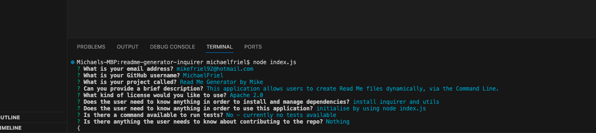

# ReadMe Generator

## Description
This application allows the user to dynamically create a ReadMe file, via the Command Line. Once the application has been initialised, the user will be prompted to answer a number of questions; the content from which will inform the ReadMe file once generated.

**This functionality is achieved in the following way:**

* Inquirer is used to generate the questions in the terminal.
  * Questions and answers are stored in a variable and passed to the prompt.
* Require functions are used for the file system, url path, Inquirer and the utility Javascript file which contains the Markdown.
* Markdown is created as a string and answers from the Inquirer prompts are passed into the string in order to dynamically populate based on user input.

## Installation
In order to use this application, you will need to install Inquirer. You will also need to clone this repository in order to initialise the function on your local machine.

## Usage
This uses the inquirer package to ask questions about the ReadMe content. This can be initialised by typing the **node index.js** command into the terminal. A full tutorial video can be found here: https://drive.google.com/drive/folders/13VxCOtkFwGm5KrXl0mjgmwb4sN9vwNUp?usp=sharing

  
*This screenshot shows the terminal, with each of the questions having been asnwered by the user.*

## License
This application is covered under the Mit License

## Tests
Currently no tests available

## Questions
If you have any questions, you can contact me in the following ways: 
[Git Hub Profile](https://github.com/MichaelFriel) (github.com/MichaelFriel) 
Email: mikefriel92@hotmail.com
